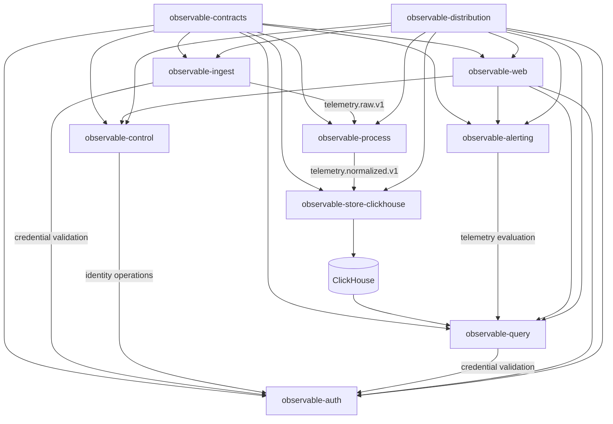

# Component Decomposition

> **Status:** Target architecture.
>
> This document defines the decomposition target referenced by [ROADMAP.md](../ROADMAP.md) and
> [ADR-035](../spec/adr/ADR-035-component-independence.md). The current monorepo remains the
> implementation baseline while the migration is in progress.

## Goal

Break Observable into independently buildable, versioned, deployable, and evolvable components
without creating a distributed monolith.

Repository extraction is the final step, not the first. Boundaries must first be made real through
versioned contracts, explicit state ownership, independent artifacts, and compatibility tests.

## Principles

1. Components share contracts, not implementation.
2. Each persistent table or schema has exactly one owning component.
3. Cross-component writes use APIs or events, never another component's database credentials.
4. High-volume telemetry boundaries use Redpanda and versioned event contracts.
5. Synchronous HTTP is used only when the caller requires the result before continuing.
6. Every deployable component has its own image, version, changelog, CI, SBOM, and provenance.
7. Full-platform compatibility is verified by the distribution repository.
8. Repository extraction happens only after the component can build and test without sibling source.

## Target Components

### observable-contracts

Owns versioned integration contracts:

- OpenAPI specifications
- internal event schemas
- shared wire DTO definitions
- generated client configuration
- compatibility checks
- Modelable source definitions that are genuinely cross-component contracts

The current `libs/domain` crate must not become a cross-repository shared implementation package.
Configuration/env-var loading, OTel telemetry setup, and stream-processor's envelope
normalization/merge logic have been split out into `libs/observable-config`,
`libs/observable-telemetry`, and `libs/observable-process` respectively — component-local
implementation utilities, not cross-component contracts. The WASM playground vendors
`observable-process` as a monorepo path dependency to simulate the ingest-to-process pipeline
client-side; this in-repo reuse is acceptable during decomposition but must be resolved (vendored
copy or dropped) before `observable-web` and `observable-process` extract into separate
repositories, since the target dependency graph does not have web depend on process.

`libs/domain` now holds only wire DTOs (`Span`, `SpanEvent`, `LogRecord`, `MetricSeries`/
`MetricPoint`, `TelemetryEnvelope`, `VisualizationFrame`) and has no generated code and no
ClickHouse/`storage` feature of its own. All ClickHouse row projections — both the hand-written
metric rows and the Modelable-generated tracing/log rows (`SpanRow`, `SpanEventRow`, `LogRow`) —
live in `libs/observable-storage-contracts`, depended on by `storage-writer`, `query-api`, and their
integration tests. Per ADR-035 this crate, not either service, is the versioned storage contract
between `observable-store-clickhouse` and `observable-query`.

`scripts/regenerate-models.sh` and `scripts/check-generated-drift.sh` route each Modelable domain's
generated Rust to whichever `libs/*/src/generated/<domain>` directory is already checked in (tracing
and logs under `libs/observable-storage-contracts`), rather than assuming a single fixed crate.
Modelable's Rust emitter gates ClickHouse projection types behind `cfg(feature = "storage")`
regardless of target crate, so `observable-storage-contracts` carries its own always-on `storage`
feature purely to satisfy that generated cfg.

### observable-ingest

Derived primarily from `services/ingest-gateway`.

Owns:

- OTLP/gRPC
- OTLP/HTTP
- Prometheus remote_write
- ingest-token authentication
- rate limiting
- cardinality admission
- tenant/environment stamping
- publication of accepted telemetry to Redpanda

Target runtime dependencies:

- auth API
- Redpanda
- released contracts

It must not require PostgreSQL or ClickHouse credentials and must not own deployment markers,
change events, dashboards, alerts, or other control-plane state.

### observable-process

Derived from `services/stream-processor`.

Owns:

- consumption of raw ingest events
- normalization
- enrichment
- span-derived metrics
- telemetry transformations
- publication of normalized telemetry

The target pipeline is:

```text
telemetry.raw.v1 -> observable-process -> telemetry.normalized.v1
```

The current processor-to-storage HTTP calls are transitional coupling and must be removed.

### observable-store-clickhouse

Derived from `services/storage-writer` and `migrations/clickhouse`.

Owns:

- normalized telemetry consumption
- batching
- ClickHouse insertion
- telemetry retention
- ClickHouse migrations
- storage health

It consumes `telemetry.normalized.v1` directly from Redpanda. It does not expose application-facing
write APIs.

The ClickHouse schema is a versioned storage contract between storage and query. Query may read
ClickHouse directly for performance, but supported schema-version ranges must be explicit and
covered by compatibility tests.

### observable-query

Derived from `services/query-api`, `libs/query-core`, and the portable parts of
`libs/domain-core`.

Owns:

- trace queries
- log queries
- metric queries
- topology
- service discovery
- infrastructure discovery
- correlation
- reliability queries
- NLQ/MCP translation
- query planning

Control-plane CRUD is removed from this component. The target query runtime has no PostgreSQL
dependency for core operation.

### observable-control

Derived from `services/admin-service` plus control-plane handlers currently spread across
`query-api` and `ingest-gateway`.

Owns:

- tenants, projects, and environments
- platform configuration
- dashboards
- saved views
- schema/catalog annotations
- deployment markers
- change events
- setup/onboarding metadata
- agent/collector fleet registration, health status, and remote-config versioning

Identity administration exposed through control-plane UX delegates to the Auth API; Control does
not own credential or membership tables.

Target runtime dependencies:

- PostgreSQL
- auth API

Usage reporting that requires telemetry must call the query component instead of reading ClickHouse
directly.

### observable-auth

Derived from `services/auth-service`.

Owns:

- OIDC integration
- users and identity mappings
- tenant memberships and roles
- sessions
- API-key lifecycle and validation
- credential audit

Consumers use the released Auth API contract. The current `libs/observable-auth` HTTP wrapper is
not a permanent shared implementation package; callers should use generated contract clients plus
small component-local middleware.

### observable-alerting

Combines alerting responsibilities currently spread across `alert-evaluator`, `query-api`, and
`admin-service`.

Owns:

- alert-rule CRUD
- SLO definitions
- evaluation
- alert firings
- notifications
- incidents
- silencing
- escalation state

The preferred target is:

```text
observable-alerting -> observable-query -> telemetry
```

Direct ClickHouse access is allowed only if performance evidence justifies an explicit exception.

### observable-web

Derived from `apps/frontend`.

Depends only on released APIs from:

- auth
- control
- query
- alerting

The browser playground remains with the web component initially. It should become a separate
component only if it develops an independent lifecycle.

### observable-distribution

Owns product composition and full-platform integration:

- Docker Compose
- Helm umbrella chart
- demos
- full-system E2E tests
- kind testbench
- upgrade/rollback tests
- deployment documentation
- supported component-version manifest

It contains no production service implementation.

A distribution release pins compatible component releases, for example:

```yaml
productVersion: 0.2.0
components:
  contracts: 1.1.0
  auth: 0.3.2
  control: 0.2.1
  ingest: 0.4.0
  process: 0.2.4
  storeClickhouse: 0.3.0
  query: 0.4.1
  alerting: 0.2.0
  web: 0.5.0
```

## Target Dependency Graph


```mermaid
flowchart TD
    contracts[observable-contracts]

    auth[observable-auth]
    control[observable-control]
    ingest[observable-ingest]
    process[observable-process]
    store[observable-store-clickhouse]
    query[observable-query]
    alerting[observable-alerting]
    web[observable-web]
    distribution[observable-distribution]

    contracts --> auth
    contracts --> control
    contracts --> ingest
    contracts --> process
    contracts --> store
    contracts --> query
    contracts --> alerting
    contracts --> web

    ingest -->|telemetry.raw.v1| process
    process -->|telemetry.normalized.v1| store
    store --> clickhouse[(ClickHouse)]
    clickhouse --> query

    ingest -->|credential validation| auth
    control -->|identity operations| auth
    query -->|credential validation| auth
    alerting -->|telemetry evaluation| query

    web --> auth
    web --> control
    web --> query
    web --> alerting

    distribution --> auth
    distribution --> control
    distribution --> ingest
    distribution --> process
    distribution --> store
    distribution --> query
    distribution --> alerting
    distribution --> web
```

There must be no source/package dependency cycle between deployable components.

## Data Ownership

PostgreSQL may remain one physical server during the migration, but ownership must be separated by
schema and credentials.

| Owner | PostgreSQL scope |
| --- | --- |
| `observable-auth` | users, memberships/roles, sessions, API keys, credential audit |
| `observable-control` | tenants/projects/environments, configuration, dashboards, deployment/change metadata |
| `observable-alerting` | alert rules, SLOs, firings, notifications, incidents |

Rules:

- no cross-owner SQL
- no shared write credentials
- cross-component access uses an API or event
- physical databases may be split later without changing application contracts

ClickHouse ownership:

| Component | Access |
| --- | --- |
| `observable-store-clickhouse` | writes + migrations |
| `observable-query` | reads within a declared schema compatibility range |

## Communication Contracts

### Public and control APIs

Use HTTP + OpenAPI.

Examples:

```text
web -> auth
web -> control
web -> query
web -> alerting
alerting -> query
```

### Telemetry pipeline

Use Redpanda + explicit versioned event schemas.

```text
ingest -> telemetry.raw.v1 -> process -> telemetry.normalized.v1 -> store
```

Do not serialize arbitrary Rust domain structs as the durable cross-component contract.

### Cross-domain state changes

Use versioned events when eventual consistency is acceptable, for example:

- `DeploymentChanged.v1`
- `TenantDeleted.v1`
- `ApiKeyRevoked.v1`
- `AlertFired.v1`
- `IncidentCreated.v1`

## Release Model

The current root `VERSION` and `observable-services` image remain transitional until the
decomposition reaches independent-artifact readiness.

The target release model is per-component SemVer:

```text
observable-auth:vX.Y.Z
observable-control:vX.Y.Z
observable-ingest:vX.Y.Z
observable-process:vX.Y.Z
observable-store-clickhouse:vX.Y.Z
observable-query:vX.Y.Z
observable-alerting:vX.Y.Z
observable-web:vX.Y.Z
```

The distribution repository has its own product version and records the exact supported component
combination.

## Migration Plan

### Phase 0 — Define ownership

Before moving source:

- assign every source area to one target component
- assign every PostgreSQL table to one owner
- assign ClickHouse schema ownership
- assign every public/internal API to one owner
- assign every event/topic to one owner
- prohibit new cross-service source dependencies and cross-domain SQL

Exit evidence:

- every source area, table, API, and event has one documented owner

### Phase 1 — Extract contracts

Create the contracts boundary.

- separate wire contracts from implementation utilities in `domain`
- define `telemetry.raw.v1`
- define `telemetry.normalized.v1`
- generate Rust/TypeScript clients/types from released contracts
- add breaking-change detection

The Redpanda topic ingest publishes to and stream-processor consumes from is now named
`telemetry.raw.v1` (was the unversioned `telemetry.raw`) in `libs/observable-config`'s dev default,
Helm `values.yaml`/`values.production-example.yaml`, `charts/observable-infra`, and
`docker-compose.yml`.

Breaking-change detection is implemented for Modelable `.mdl` contracts: `scripts/check-generated-drift.sh`'s `modelable compile` step already rejects a subset of breaking changes (removing a field that a `projection` still references crashes compilation with a referential-integrity error), but does not reject a self-consistent field removal/retype that leaves no dangling reference. `scripts/check-breaking-changes.py` (invoked by `scripts/check-breaking-changes.sh BASE_REF HEAD_REF`, and wired into the `generated-code` CI job and `scripts/local-ci.sh`) closes that gap: for every entity/projection ref unchanged in version number between the base and head `models/` trees, it diffs `modelable describe`'s field list and fails if a field was removed, retyped, or renamed without a version bump; additive entities may still gain new fields on the same version.

`contracts/schemas/<domain>/*.json` now holds committed JSON Schema (2020-12) artifacts, generated
by Modelable alongside the Rust/TypeScript targets, for the signal types that make up
`telemetry.raw.v1`'s payload: `tracing.Span`, `tracing.SpanEvent`, `logs.LogRecord`,
`metrics.MetricPoint`. `scripts/regenerate-models.sh`/`check-generated-drift.sh` keep them in sync
with `.mdl` sources the same way as the Rust/TS artifacts. `libs/domain/src/contract_schema_test.rs`
(a `#[cfg(test)]` module, so it runs under the same `cargo test --lib` CI already uses) validates
that the hand-authored Rust structs' actual serde output — not just the `.mdl` definitions — still
conforms to these schemas; it caught a real drift scenario (a `#[serde(rename)]` silently diverging
from the schema) during development. Two gaps remain, both documented in AGENTS.md: the json-schema
emitter doesn't honor `@wire(json.fieldCase: "snake_case")` (schemas are camelCase, real wire JSON is
snake_case, so the test converts field names before validating), and optional fields are typed
non-nullable even though `Option::None` serializes as JSON `null`.

This still does not fully satisfy the exit evidence below: `MetricSeries` (the other half of the
`Metrics` envelope variant) isn't modeled in Modelable at all, and the `TelemetryEnvelope`/
`EnvelopePayload` wrapper itself — the actual `telemetry.raw.v1` payload shape, not just its
constituent signal types — isn't modeled or schema-checked, likely blocked by the same
no-native-enum/nested-type limitation documented in `tracing.mdl`'s header for the Rust emitter.

Exit evidence:

- no cross-component wire format exists only as an application-language struct

### Phase 2 — Break processor/storage coupling

- make storage consume `telemetry.normalized.v1`
- make processor publish normalized events
- dual-run HTTP and queue paths during verification if required
- add idempotency based on stable event identity
- remove `/internal/spans`, `/internal/logs`, and `/internal/metrics`

The dual-run path is implemented: `domain::NormalizedTelemetryBatch` is the `telemetry.normalized.v1`
wire type (spans/logs/series/points together, since one stream-processor batch interval typically
mixes signal types). `storage-writer` always runs a `NormalizedConsumer` subscribed to that topic,
forwarding straight into the existing `WriteBuffer` — the same code path the HTTP handlers use.
`stream-processor` still defaults to its original HTTP push (`STORAGE_WRITE_MODE` unset/`http`);
setting `STORAGE_WRITE_MODE=queue` switches it to publish `NormalizedTelemetryBatch` to the topic
instead. Only one path is active at a time (no double-write into ClickHouse); the HTTP endpoints
are not yet removed, and the span-derived-metrics background flush (a separate aggregation path)
still always uses HTTP regardless of this switch. Verified end-to-end with the real
`docker compose --profile verification` smoke suite in both modes: default HTTP, and with
`STORAGE_WRITE_MODE=queue` set (confirmed via `storage-writer`'s
`storage_writer_http_requests_total` Prometheus counter that zero HTTP calls to the ingestion
endpoints occurred in queue mode, aside from the one expected metrics-aggregator flush).

**Outage-survival (not row-level dedup) idempotency is now in place**, covering both hops:

- `stream-processor`'s `QueueConsumer` (consuming `telemetry.raw.v1`) disables `enable.auto.commit`
  and commits each batch's offset only after its handler (the HTTP POST or the queue-mode Kafka
  publish, whichever `STORAGE_WRITE_MODE` selects) succeeds, retrying with exponential backoff
  (500 ms → 30 s cap, indefinitely) on failure rather than dropping the batch.
- `storage-writer`'s `WriteBuffer` flush loops (`buffer.rs`) now retry a failed ClickHouse insert
  with the same backoff policy instead of logging-and-dropping. Two send APIs exist on the same
  underlying channels: `send_spans`/`send_logs`/`send_metrics` remain non-blocking best-effort
  (drop-on-full-channel) for the HTTP handlers, unchanged in external contract; new
  `send_spans_durable`/`send_logs_durable`/`send_metrics_durable` block until the submitted rows
  are confirmed flushed (an per-submission `oneshot` ack fired only after a successful — possibly
  retried — ClickHouse write), backpressuring on a full channel instead of dropping.
- `NormalizedConsumer` also disables auto-commit and calls the `_durable` variants, committing each
  message's offset only after its rows are confirmed durably written. A storage outage therefore
  blocks the consumer loop (no further `recv()`) rather than silently dropping data, and offsets
  are never committed past data that isn't actually in ClickHouse yet.

This is at-least-once outage survival, not exactly-once/row-level idempotency: a process crash
between a successful ClickHouse insert and the (async, fire-and-forget) Kafka commit can still
redeliver and re-insert a batch on restart. `spans`/`logs`/`span_events` are plain `MergeTree`
(no dedup on re-insert); only `metric_points`/`metric_series` use `ReplacingMergeTree`. Making
writes idempotent against that crash window (a stable per-row identity + `ReplacingMergeTree` or
equivalent for the other three tables) is a separate, schema-touching change, deliberately not done
here. Verified end-to-end with the real `docker compose --profile verification` smoke suite in both
`STORAGE_WRITE_MODE=http` and `=queue`, confirming no retry/error noise in either service's logs
under normal (non-outage) operation.

Not yet addressed: cutting `stream-processor`'s default over to `queue` mode, the row-level dedup
above, and removing the HTTP endpoints — those remain open exit-evidence items below.

Exit evidence:

- processing continues through storage outages up to Redpanda retention limits
- storage recovers by consuming the durable backlog

### Phase 3 — Establish database ownership

- introduce logical PostgreSQL ownership schemas and separate credentials
- remove cross-owner SQL
- move ClickHouse migrations under storage ownership
- introduce explicit ClickHouse schema compatibility metadata

Exit evidence:

- every component can enumerate the tables it owns
- no component executes SQL against another component's PostgreSQL schema

### Phase 4 — Shrink query

Move control-plane CRUD out of query and split the current admin surface by owner:

- member/role/API-key lifecycle -> auth
- dashboards
- saved views
- tenants
- schemas/annotations
- deployments
- change events

Move reliability state to alerting:

- alerts
- SLOs
- notifications
- incidents

Exit evidence:

- core query operation requires no PostgreSQL connection

### Phase 5 — Clean ingest

Move deployment/change-event APIs and deployment-registry state out of ingest.

For enrichment that still requires deployment correlation, prefer a control-plane event-fed local
cache or query-time correlation rather than direct PostgreSQL access.

Exit evidence:

- ingest runtime dependencies are auth + Redpanda only

### Phase 6 — Consolidate alerting

Move all alert/SLO/incident/notification APIs and persistence into one component.

Prefer query API calls for telemetry evaluation.

Exit evidence:

- alerting state has one owner
- query and control do not write alerting tables

### Phase 7 — Independent build artifacts

Before repository extraction:

- produce one image per component
- make CI service-scoped
- give each component an independent version
- change Helm values to per-component image/version pins
- create the distribution component manifest

Exit evidence:

- changing query does not rebuild auth, ingest, process, or storage

### Phase 8 — Extract repositories

Extract in dependency order:

1. `observable-contracts`
2. `observable-store-clickhouse`
3. `observable-process`
4. `observable-ingest`
5. `observable-auth`
6. `observable-query`
7. `observable-control`
8. `observable-alerting`
9. `observable-web`
10. `observable-distribution`

For each extraction:

1. preserve relevant Git history
2. establish independent CI and release
3. consume released contract/dependency versions
4. replace monorepo source coupling with the released artifact
5. run distribution E2E
6. remove the old source only after compatibility passes

## Component Definition of Done

A component is independent when:

1. it builds from a clean checkout without sibling component source
2. it releases without rebuilding unrelated components
3. it owns its persistent state
4. it integrates through versioned APIs/events only
5. supported compatibility ranges are documented and tested
6. its container can be deployed and scaled independently
7. full-platform compatibility is verified by the distribution repository

## Migration Constraint

The platform must remain runnable throughout decomposition. Do not perform a big-bang repository
split. Every migration slice must preserve the current user-visible capability or provide a
documented compatibility bridge and rollback path.
