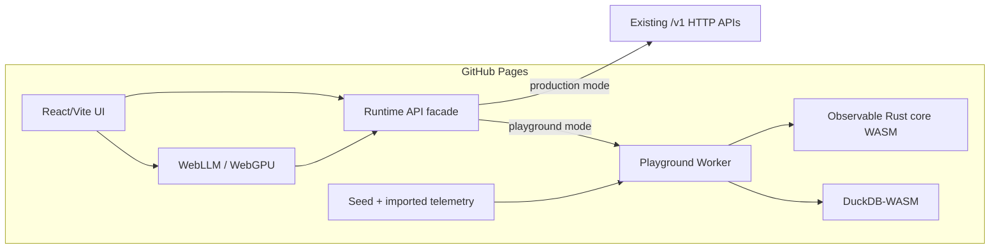

# GitHub Pages WebAssembly Playground — Implementation Plan

> **Status:** Proposed implementation plan. This document does not change Observable's accepted production deployment or storage architecture. Before the playground becomes a supported deployment profile rather than an experimental/demo target, add an ADR and synchronize affected specs per `AGENTS.md`.

**Goal:** Publish a useful Observable playground at `https://ktjn.github.io/observable/` that runs entirely in the browser, reuses the production React UI, executes as much Observable logic as practical in WebAssembly, requires no backend, and is deployable as a static GitHub Pages site.

**Primary principle:** Preserve product behavior and contracts, not production infrastructure. Components that fundamentally require a server, durable distributed infrastructure, or inbound networking may be replaced by browser-local equivalents in playground mode.

**Target experience:** A visitor opens the playground and can immediately explore realistic traces, logs, metrics, services, topology, dashboards, alerts, SLOs, deployments, and the query workbench. Data can be generated locally or imported. Refreshing the page may reset the session in the first version. No account, API key, Docker, Kubernetes, or hosted Observable backend is required.

---

## 1. Scope and constraints

### In scope

- Reuse `apps/frontend` and its existing React 19/Vite/TanStack Router UI.
- Build a separate `playground` runtime profile without changing production runtime behavior.
- Compile portable Rust domain, normalization, processing, query-planning, and evaluation logic to `wasm32-unknown-unknown`.
- Run CPU-heavy playground logic off the main UI thread in Web Workers.
- Replace ClickHouse/PostgreSQL with a browser-local analytical store.
- Replace Redpanda with an in-process/bounded browser-local pipeline.
- Replace Zitadel/OpenFGA with a deterministic local playground identity/authorization model.
- Reuse WebLLM for optional fully client-side NLQ where the browser supports WebGPU.
- Generate realistic multi-service telemetry entirely in-browser.
- Import local telemetry files without uploading them anywhere.
- Deploy with GitHub Actions to GitHub Pages.
- Keep the built playground functional without calls to an Observable server.

### Explicit non-goals

- Do not turn GitHub Pages into an externally reachable OTLP endpoint. A browser page cannot accept arbitrary inbound OTLP/gRPC traffic from other workloads.
- Do not emulate Kubernetes, Redpanda, ClickHouse clustering, OpenFGA, or Zitadel inside the browser.
- Do not make playground behavior part of the production availability, durability, multi-tenancy, or security guarantees.
- Do not require persistence across browser reloads in the first release.
- Do not use WebAssembly threads/`SharedArrayBuffer` as a hard requirement. Standard GitHub Pages does not provide the custom COOP/COEP response headers needed for cross-origin-isolated threaded WASM.
- Do not make WebLLM mandatory; model downloads and WebGPU availability make it an optional capability.
- Do not silently send user-entered telemetry, queries, or credentials to external services.

---

## 2. Current architecture implications

The existing codebase is already well-positioned for this work:

- Production data-plane services are Rust (`ADR-004`).
- The frontend is already a static React/Vite SPA (`ADR-006`).
- `services/query-api/src/planner/` contains pure SQL-planning logic that is a strong extraction candidate.
- Generated shared models already exist through Modelable and are committed for both Rust and TypeScript (`ADR-032`).
- WebLLM is already present in the frontend and accepted as a client-side NLQ provider (`ADR-035`).

The main blocker is dependency coupling. `libs/domain` currently pulls server/runtime dependencies such as `axum`, `tonic`, `reqwest`, OpenTelemetry exporters, and tracing subscribers. The service crates likewise combine pure policy/business logic with HTTP, Kafka, ClickHouse, PostgreSQL, and Tokio runtime concerns. Those boundaries need to be separated before meaningful reuse in WASM is possible.

This is useful refactoring even outside the playground: production services should depend on portable core logic rather than owning that logic inside adapters.

---

## 3. Proposed playground architecture



### Runtime rule

The React application must not know whether a request is served by HTTP or the local playground engine. Introduce one explicit transport/runtime boundary and keep existing feature hooks/components above it.

Do not monkey-patch `window.fetch`. Do not build a fake server abstraction around Service Workers. Both approaches hide the deployment mode and make behavior difficult to test.

### Recommended split

```text
apps/frontend/
  src/runtime/
    runtime.ts
    httpRuntime.ts
    playgroundRuntime.ts
    types.ts
  src/playground/
    worker.ts
    workerClient.ts
    capabilities.ts
    seed.ts

libs/
  domain-core/             Rust, platform-neutral
  query-core/              Rust, platform-neutral
  processing-core/         Rust, platform-neutral
  alert-core/              Rust, platform-neutral
  playground-wasm/         wasm-bindgen boundary only

apps/frontend/public/playground/
  fixtures/
  wasm/
```

Exact crate names may change during extraction; the important constraint is that the WASM-facing crates must not depend on server adapters.

---

## 4. Component replacement matrix

| Production component | Playground replacement | Runs as WASM | Notes |
| --- | --- | --- | --- |
| React/Vite frontend | Same frontend | No | Reused almost unchanged |
| query-api HTTP boundary | `RuntimeApi` + worker command protocol | Partly | Pure planning/response shaping in Rust WASM |
| ingest-gateway HTTP/gRPC | Local import/generator API | Yes | No externally reachable listener |
| stream-processor | Local synchronous/batched processing pipeline | Yes | Run in worker |
| storage-writer | Direct batch insert into local DB | Yes/JS glue | No queue durability requirement |
| ClickHouse | DuckDB-WASM | Yes | Browser OLAP engine, local session data |
| PostgreSQL | Small local configuration repository | Optional | Prefer simple IndexedDB/in-memory JSON initially |
| Redpanda | Bounded in-memory queue/batch pipeline | Yes | Preserve stages/metrics, not distributed guarantees |
| OpenFGA | Deterministic local authorizer | Yes | Fixed demo principal/tenant, policy interface retained |
| Zitadel | Playground identity provider | No | Synthetic authenticated user |
| alert-evaluator | Extracted pure evaluator + browser timer | Yes | Notifications rendered locally |
| webhook notifications | Local notification sink | No | No external writes by default |
| object storage | Blob/File API | No | Import/export only |
| DataFusion/ClickHouse SQL execution | DuckDB-WASM initially | Yes | Keep execution behind trait; evaluate DataFusion-WASM later |
| remote LLM | WebLLM | WebGPU | Optional; no query-data egress |

### Why DuckDB-WASM first

Use DuckDB-WASM as the initial browser query/storage engine because it is a maintained browser-targeted analytical database with a stable JavaScript/WASM client, Web Worker support, Arrow interoperability, and no server requirement.

Do not couple Observable's portable query logic directly to DuckDB. Define a local execution adapter so DataFusion-WASM can be evaluated later without another frontend rewrite. Apache Arrow supports `wasm32-unknown-unknown`; DataFusion WASM is promising but still sufficiently experimental that it should be a follow-up compatibility track, not the first dependency of the public playground.

The target is behavioral compatibility of Observable APIs and visualizations, not byte-identical ClickHouse SQL.

---

## 5. Browser execution model

### Main thread

Only:

- React rendering.
- User interaction.
- TanStack Query/Router.
- Worker RPC coordination.
- WebLLM UI integration.

Never execute telemetry generation, OTLP decoding, large transformations, or SQL queries on the main thread.

### Playground worker

Own one worker for the local Observable runtime:

```text
React
  -> postMessage(command)
Playground Worker
  -> Rust WASM core
  -> DuckDB-WASM worker/runtime
  -> response
React
```

If DuckDB-WASM requires its own worker, the playground worker coordinates it rather than moving query processing back to the main thread.

### No shared-memory requirement

GitHub Pages cannot be assumed to emit COOP/COEP headers, so the public playground must work with single-threaded WASM binaries. Use multiple independent Web Workers for concurrency where useful. A future deployment on a host that supports cross-origin isolation may enable threaded variants behind capability detection, but the Pages build must not depend on them.

---

## 6. Portable Rust extraction

This is the highest-value architectural work in the plan.

### `domain-core`

Move or expose platform-neutral types and transformations from `libs/domain` without pulling:

- `axum`
- `tonic`
- `reqwest`
- ClickHouse client code
- OpenTelemetry exporters
- Tokio networking/runtime features
- tracing subscriber setup

`domain-core` should primarily depend on `serde`, generated model types, timestamp/UUID primitives that compile on WASM, and small pure libraries.

Production `libs/domain` can depend on `domain-core` and retain server-specific integrations.

### `query-core`

Extract from query-api:

- request parameter validation
- query planning
- filters/facets
- histogram bucket calculation
- shorthand parsing
- NLQ IR parsing/validation where transport-independent
- visualization-frame construction
- response transformation
- service/topology query planning

Do not move:

- Axum handlers
- auth middleware
- ClickHouse client calls
- PostgreSQL reads
- HTTP LLM caller

The existing `services/query-api/src/planner/` code is the starting point. Where SQL is ClickHouse-specific, split semantic planning from dialect rendering:

```text
Query request
  -> semantic plan
  -> ClickHouse renderer      production
  -> DuckDB renderer          playground
```

Do not maintain two unrelated planners.

### `processing-core`

Extract pure ingest/stream behavior:

- validation
- normalization
- environment stamping based on local playground context
- span-derived RED metrics
- enrichment
- topology derivation inputs
- cardinality accounting
- sampling/filter decisions that do not require network/storage adapters

Production stream-processor and playground WASM should call the same functions.

### `alert-core`

Extract:

- threshold evaluation
- burn-rate calculation
- composite rule evaluation
- SLO math

Keep webhook/network delivery in production adapters. The playground sink writes alert events to local state and UI.

### `playground-wasm`

This crate contains only the `wasm-bindgen` boundary and serialization glue. It should expose coarse-grained batch operations rather than one WASM call per row.

Example command surface:

```text
initialize(seed_config)
ingest_otlp_json(batch)
ingest_otlp_protobuf(bytes)
generate_traffic(config)
plan_query(request)
normalize_batch(batch)
evaluate_alerts(snapshot)
parse_nlq_completion(text)
```

Keep large result sets in Arrow/typed binary form where practical. Avoid repeatedly serializing hundreds of thousands of rows through JSON across the JS/WASM boundary.

---

## 7. Local storage model

### First release: session-local

Prefer an ephemeral database initialized on page load.

Reasons:

- Simplest user model: refresh means reset.
- Avoids browser-specific persistent filesystem behavior.
- Avoids schema migration/versioning in the first playground release.
- Prevents stale demo data after Observable schema changes.
- Keeps CI deterministic.

Add explicit `Reset playground` and `Load sample dataset` actions.

### DuckDB schema

Create DuckDB tables that model the API-level semantics required by the frontend, not a mechanical copy of ClickHouse DDL.

At minimum:

- spans
- logs
- metrics / metric samples
- deployments/change events
- service metadata/topology rollups where materialization is beneficial
- dashboards
- alerts
- SLOs
- saved views
- incidents if the UI needs mutable incident state

Keep tenant/environment columns even though the first playground has one synthetic tenant. This prevents playground-only shortcuts from leaking into shared query code.

### Later persistence

After the session-only release is stable, evaluate:

1. export/import of a playground snapshot
2. IndexedDB persistence for small control-plane state
3. OPFS-backed database persistence only after browser compatibility and DuckDB-WASM durability are proven in CI

Do not make OPFS required for v1.

---

## 8. Synthetic telemetry and import

A playground needs data immediately. Do not ship only static screenshots or mocked API fixtures.

### Browser-local demo generator

Implement a deterministic generator in Rust core with a seed parameter.

Default topology:

```text
web
 -> api-gateway
 -> checkout
 -> payment
 -> inventory
 -> database

api-gateway
 -> catalog
 -> search
```

Generate:

- successful and failed traces
- nested spans
- async parent-span gaps to exercise topology fallback logic
- structured logs correlated by trace/span id
- RED metrics
- host/container/infrastructure attributes
- deployments and change events
- latency regression after one deployment
- an error spike
- one SLO burn event
- one noisy/high-cardinality attribute case

The generated scenario should intentionally exercise every major screen instead of optimizing for realism alone.

### Time model

Generate data relative to `Date.now()` at initialization so existing relative-time filters work without special UI handling.

Provide presets:

- `Small`: ~10k spans/logs, instant startup
- `Standard`: ~100k rows total, default
- `Large`: browser stress test, opt-in

Exact limits must be set from measured browser memory/startup benchmarks, not guessed.

### Import

Support in stages:

1. Observable playground snapshot
2. OTLP/HTTP JSON files
3. OTLP protobuf payload files
4. optional Parquet/Arrow import for development/debugging

All imports are local. Use `File`/`Blob` APIs; do not upload files to GitHub or a backend.

Reject oversized inputs before decoding. Put hard caps on rows/bytes and show the limit in the UI.

---

## 9. Frontend runtime abstraction

The frontend currently assumes same-origin `/v1` endpoints. Convert this into an explicit adapter without changing component behavior.

### Target interface

Use a typed API surface around the operations already exposed through `apps/frontend/src/api/*`.

Prefer domain methods over generic fake HTTP:

```text
runtime.traces.search(...)
runtime.logs.search(...)
runtime.metrics.query(...)
runtime.services.list(...)
runtime.dashboards.list(...)
runtime.alerts.create(...)
runtime.nlq.prepare(...)
```

Production implementation delegates to current `fetch` code.

Playground implementation sends typed commands to the worker.

If converting every API module at once is too large, introduce a shared `apiRequest` transport seam first, then progressively lift it to domain methods. Do not leave a permanent generic URL-switching abstraction if a typed runtime can replace it.

### Runtime selection

Build-time mode only:

```text
VITE_OBSERVABLE_RUNTIME=http
VITE_OBSERVABLE_RUNTIME=playground
```

Do not allow arbitrary runtime selection through query-string flags in the public site.

### Identity

In playground mode provide:

- user: `playground@local`
- tenant: `demo`
- role: platform admin or an explicit `playground` role mapped to all local capabilities
- environments: at least `production` and `staging`

Keep the same frontend auth/tenant context interfaces. Do not scatter `if (playground)` checks through feature components.

---

## 10. Query compatibility

The frontend should receive the same TypeScript response shapes in both modes.

### Rule

Every playground endpoint/operation has a conformance fixture against the production API contract.

For each operation:

1. generate a deterministic dataset
2. run request through the production core/adapter in tests
3. run the equivalent request through playground core/adapter
4. normalize nondeterministic values
5. assert response schema and semantic equivalence

### SQL compatibility

Do not translate arbitrary ClickHouse SQL strings to DuckDB with regex replacements.

Split query planning into:

```text
semantic plan -> dialect renderer -> engine
```

Implement only the dialect features needed by Observable.

Initial renderer differences will likely include:

- integer division
- quantiles/percentiles
- conditional counts
- timestamp bucketing
- array/map extraction
- JSON attribute access

Add focused renderer tests for each supported operation.

### Query workbench

The existing workbench may expose SQL. In playground mode:

- run only against the local playground database
- allow read-only statements
- reject attachment/loading of arbitrary remote resources
- reject write/export statements that can initiate network/file side effects unless explicitly designed as a safe local export action
- show `DuckDB-WASM` as the execution engine in playground metadata so users do not mistake it for production ClickHouse/DataFusion behavior

---

## 11. NLQ / WebLLM

`ADR-035` already establishes WebLLM as a client-side provider. The playground should make it the only AI provider initially.

### Default

NLQ works without AI through existing deterministic shorthand/raw-IR paths.

### Optional WebLLM path

On capable browsers:

1. build schema/prompt context locally
2. run WebLLM in-browser
3. parse/validate completion through shared Rust core/WASM
4. execute the resulting plan locally

Do not require query-api `/prepare` and `/complete` endpoints in playground mode; their server-enforced session token exists to protect a server trust boundary that does not exist when the whole playground is local. Reuse the underlying provider-independent prompt/IR logic instead.

### Security/UX

- Never silently fall back to a remote LLM.
- Do not request API keys in the first playground release.
- Make model download size/network use explicit before starting WebLLM.
- Cache behavior is browser-managed; do not claim the playground is fully offline until all required model/assets are already cached.

---

## 12. GitHub Pages build and routing

### Vite base path

Production remains unchanged.

Playground build sets:

```text
base=/observable/
```

All WASM, worker, fixture, font, and application assets must resolve under the repository Pages path. No absolute `/assets/...` URLs.

### SPA routing

GitHub Pages does not provide application rewrites. Use hash history for the playground build rather than a fragile generated `404.html` redirect hack.

Production continues using the current router mode.

Example:

```text
https://ktjn.github.io/observable/#/traces
https://ktjn.github.io/observable/#/services/checkout
```

### WASM asset packaging

Build Rust bindings with a deterministic toolchain such as `wasm-pack`/`wasm-bindgen` and bundle outputs through Vite.

Self-host required WASM/worker assets in the Pages artifact. Do not depend on a CDN for the core playground runtime.

If DuckDB extensions are required, pin and package only the required signed extension assets or choose an ingestion path that avoids runtime extension downloads. The standard demo must not break because a third-party CDN is unavailable.

### GitHub Actions

Add a dedicated Pages workflow or extend the existing build pipeline with a reusable script.

Per repository policy, put non-trivial build logic in `scripts/`, for example:

```text
scripts/build-playground.sh
```

The script should:

1. install/verify the WASM Rust target/tooling
2. build the portable Rust WASM package
3. install frontend dependencies with `npm ci`
4. run the playground frontend build
5. verify no root-relative asset paths
6. emit the static Pages artifact

The GitHub Actions YAML should orchestrate the script and `actions/upload-pages-artifact` / `actions/deploy-pages`, not contain a parallel implementation of the build.

---

## 13. Security constraints

The public playground is untrusted browser code running on untrusted user data. Treat local execution as a security boundary even though there is no server.

### Required

- No secrets in the Pages bundle.
- No production endpoints, credentials, tenant ids, or example tokens in generated assets.
- No automatic telemetry upload.
- Imported data never leaves the browser unless the user explicitly uses a future export/share feature.
- Hard size/row limits before allocation/decoding.
- Read-only arbitrary SQL at most; block engine features that can make external network requests.
- Content rendered from log/span attributes must follow existing React escaping rules; never render imported HTML unsafely.
- WebLLM must never cause a remote-provider fallback.
- Keep dependencies pinned through normal Cargo/npm lockfiles and include WASM artifacts in dependency/security review.

### Do not fake security

The synthetic playground user bypasses real authorization by design. Label the mode clearly. Do not present local OpenFGA emulation as a security test or authorization guarantee.

---

## 14. Feature rollout

> **Status (2026-08):** Phases 0–3, 5, and 7 are complete; Phases 4 and 6 are
> partially complete. Checked items below link the PR (or PRs) that delivered
> them. The remaining open items are: cross-browser smoke coverage
> (Firefox/WebKit), bundle-size/cold-start measurement, span-metrics and
> alert/SLO Rust extraction into `processing-core`/`alert-core`, worker RPC
> cancellation/progress events, health/capability UI state, scenario events
> and dataset presets, OTLP JSON import, read-only DuckDB workbench
> execution, WebLLM wired to the local NLQ pipeline, asset-integrity
> checks, and migrating the Service Detail Reliability tab's report fetch
> to the runtime seam.

### Phase 0 — viability spike

**Outcome:** prove the deployment constraints before refactoring production code.

- [x] Add a minimal throwaway branch experiment that serves React + one Rust WASM function + DuckDB-WASM under `/observable/`. (#656; retained as the `/playground-spike` route.)
- [ ] Verify Chrome, Firefox, and Safari can load the single-threaded build. (Chromium verified in CI against the built artifact; Firefox/WebKit smoke runs outstanding.)
- [x] Verify workers and `.wasm` MIME handling on actual GitHub Pages. (Deployed site loads the worker + wasm bundle — #669, #670.)
- [x] Verify no COOP/COEP requirement exists for the selected variants. (Single-threaded DuckDB bundle selected via `selectBundle`; deployed site works without cross-origin isolation.)
- [ ] Measure bundle size and cold-start time.
- [x] Verify hash routing under the repository base path. (#656, fixed for deep links in #668.)
- [x] Record chosen DuckDB-WASM version and bundle variant. (`@duckdb/duckdb-wasm` ^1.32.0, jsDelivr bundle via `selectBundle`.)

**Exit gate:** a Pages-hosted spike can create a table, insert generated rows, run a query, and return a value from Rust WASM without any server. **Met** (#656).

### Phase 1 — frontend runtime seam

**Outcome:** production and playground can satisfy the same frontend API contract.

- [x] Inventory all `apps/frontend/src/api/*` calls and their consumers. (#657 initial; re-audited in #674 before completing the migration.)
- [x] Introduce runtime/provider context at application root. (#657)
- [x] Move existing HTTP behavior behind `httpRuntime` with zero functional changes. (#657)
- [x] Add an in-memory stub playground runtime for one vertical slice. (#657)
- [x] Convert Traces first because it exercises list/detail/histogram/correlation patterns. (#657, #673)
- [x] Add runtime contract tests. (#657; expanded through #674–#679.)

**Exit gate:** production frontend tests remain unchanged in behavior; a fake playground runtime can render the Traces page without network requests. **Met** (#657).

### Phase 2 — portable Rust core

**Outcome:** shared production logic can compile natively and to WASM.

- [x] Create portable domain crate boundary. (`libs/domain-core`, #658)
- [x] Extract query semantic planning from HTTP/storage adapters. (`libs/query-core`, used natively by query-api and via wasm by the playground — #658, #659)
- [ ] Extract span metric generation/normalization from stream processing. (`processing-core` not yet created; playground metrics tables are generated directly.)
- [ ] Extract alert/SLO evaluation. (`alert-core` not yet created.)
- [x] Add `cargo check --target wasm32-unknown-unknown` for portable crates. (`scripts/build-playground.sh` builds `playground-wasm` for wasm32 via wasm-pack on every playground build.)
- [x] Add native parity tests proving services still use the extracted code. (query-api consumes query-core natively; native unit tests in libs cover planners.)

**Exit gate:** portable crates build for both native and WASM without `cfg` branches containing duplicated business logic. **Met for query planning; pending for metrics/alerts.**

### Phase 3 — playground engine

**Outcome:** browser-local Observable runtime owns data and queries.

- [x] Add `playground-wasm` bindings. (#659)
- [x] Add worker RPC protocol with request ids, cancellation, structured errors, and progress events. (Request ids + structured errors done — #659; cancellation and progress events still open.)
- [x] Initialize DuckDB-WASM in the worker runtime. (#663)
- [x] Create schema/migrations for playground tables. (`engineWorker.ts` CREATE TABLE set — spans/logs/metric_series/metric_points/change_events.)
- [x] Add batching between Rust processing and DB inserts. (JSON batch → multi-row INSERT in `seedData`.)
- [x] Implement reset/reinitialize. (#660)
- [ ] Expose health/capability state to the UI.

**Exit gate:** generated traces/logs/metrics are ingested and queryable through the runtime adapter with no HTTP calls. **Met** (#660, verified per-page by the no-network e2e assertions).

### Phase 4 — deterministic demo data

**Outcome:** every important page has meaningful data on first load.

- [x] Implement seeded Rust telemetry generator. (`generator.rs`, #660)
- [ ] Add scenario events: deployment, regression, errors, SLO burn. (Error scenarios exist implicitly; explicit scripted scenarios not yet.)
- [ ] Add Small/Standard/Large presets.
- [ ] Add a visible scenario clock/description only if needed for discoverability; do not fork core screens.
- [ ] Add import for local OTLP JSON.
- [x] Add reset/load actions under a small Playground menu. ("Reset playground" action in the demo banner — #660.)

**Exit gate:** default dataset exercises traces, logs, metrics, services, topology, deployments, and at least one alert/SLO workflow. **Partially met** — analytical signals are covered; alerts/SLOs are fixture-backed rather than derived from local telemetry.

### Phase 5 — feature parity by vertical slice

Implement in this order to maximize reuse:

1. [x] traces + trace detail (#659, #673)
2. [x] logs + facets + histograms (#663, #675)
3. [x] services + topology (#664, #665)
4. [x] metrics + service metrics (#666)
5. [x] infrastructure inventory (#678)
6. [x] deployments/change events (#667, #674)
7. [x] dashboards + saved views (#668, #677)
8. [x] alerts + SLOs (#676)
9. [x] incidents/reliability views (#676; one residual gap: the Service Detail Reliability tab still fetches its report off-seam)
10. [x] admin/config views that make sense locally (#679)

For every slice:

- [x] production runtime contract unchanged (additive ops only; `httpRuntime` delegates to unchanged fetchers)
- [x] playground response shapes match production frontend types (enforced by runtime contract tests)
- [x] no component-level playground branching unless the capability is genuinely unavailable (full seam migration audit completed in #674–#679; sole remaining branch is AppShell's justified Reset-playground gate; one residual off-seam fetch remains in the Service Reliability tab)
- [x] visual/a11y tests run against both runtime modes where applicable (visual/navigation suites cover the production runtime; each playground slice carries its own no-backend e2e spec)

**Status: complete.**

### Phase 6 — query workbench and NLQ

- [ ] Add read-only DuckDB query execution.
- [ ] Add semantic-plan/dialect conformance tests.
- [x] Reuse deterministic shorthand/raw IR locally. (Locked-service raw-IR shorthand mirrored in `playgroundRuntime.nlq.execute`; free-text questions still fall back to fixtures.)
- [ ] Wire WebLLM to local prompt/IR pipeline. (Setup page has provider/model UX; inference is not wired to a local IR pipeline yet.)
- [x] Capability-gate WebGPU. (Setup LLM page probes `navigator.gpu` and badges support.)
- [x] Add explicit model download UX. (WebLLM model picker with lazy catalog loading on the Setup LLM page.)

### Phase 7 — GitHub Pages productionization

- [x] Add `scripts/build-playground.sh`.
- [x] Add Pages workflow. (`deploy-playground.yml`, #669)
- [x] Add base-path/hash-router build mode. (`--mode playground` base `/observable/` + hash history)
- [x] Add cache-busted asset names. (Vite content-hashed output.)
- [ ] Add asset-integrity smoke checks.
- [x] Add a README link to the deployed playground only after the deployment is stable. (#670)
- [x] Add a clear Playground badge/banner that states data is local/demo data and the runtime differs from production. (#669)

**Exit gate:** merge to `main` automatically updates the public Pages site and PRs can build/test the artifact without deploying it. **Met** (#669).

---

## 15. Test strategy

### Rust

- Unit tests for extracted pure logic.
- Native/WASM compile gate for portable crates.
- `wasm-bindgen-test` or equivalent browser tests for binding behavior.
- Property tests where planner dialect rendering can diverge.

### Runtime contract

Create a shared set of contract tests for each frontend runtime operation.

Required assertions:

- success response shape
- empty result
- invalid request
- tenant/environment filtering
- pagination/limit behavior
- time-range behavior
- facet behavior
- histogram bucket boundaries
- trace/log correlation
- service topology edges

### Browser E2E

Playwright must run against the built static artifact, not only Vite dev server.

At minimum:

- Chromium full suite
- Firefox smoke suite
- WebKit smoke suite
- network-blocked test proving core screens work after local assets are loaded
- deep-link/hash-route test
- refresh/reset test
- imported-file rejection for oversized/malformed input
- WebLLM capability unavailable path

Reuse the existing visual and accessibility suites. Add playground fixtures at the runtime layer rather than duplicating page fixtures.

### No-network assertion

Add a Playwright test that aborts every request not targeting the Pages/static origin after initial app asset loading. Core navigation/querying must still pass. WebLLM tests are separate because first-use model weights are expected network traffic.

---

## 16. Performance budgets

Set budgets from Phase 0 measurements, then enforce them in CI where stable.

Initial targets to validate rather than blindly adopt:

- interactive shell before default dataset finishes generating
- default dataset ready in a few seconds on a normal desktop browser
- query interactions under ~250 ms for common filtered views on Standard dataset
- no main-thread long task caused by telemetry generation/query execution
- compressed non-model playground assets kept small enough for a public demo
- WebLLM assets excluded from initial application bundle

Track separately:

- JS bundle
- Observable Rust WASM
- DuckDB WASM
- fixture/static data
- optional WebLLM model weights

Do not hide a multi-hundred-MB default download behind one aggregate number.

---

## 17. Observability of the playground itself

Expose a small developer diagnostics panel in playground mode with:

- browser capabilities
- selected WASM/DuckDB bundle
- database row counts
- generated/imported byte counts
- worker command durations
- query durations
- WASM initialization time
- estimated in-memory dataset size
- dropped/rejected batches

Keep this local. Do not export playground telemetry to an external collector by default.

This panel is valuable because the playground itself becomes a reproducible benchmark/debug harness for portable Observable core logic.

---

## 18. Compatibility and divergence policy

The playground is allowed to replace infrastructure, but not silently redefine product semantics.

### Must match production

- frontend response types
- tenant/environment scoping semantics
- trace/log/metric identity relationships
- alert/SLO math
- query filter meaning
- timestamp representation rules (`ADR-030`)
- Modelable-generated wire/domain types where applicable

### May differ and must be labelled

- database engine
- durability
- throughput/scalability
- auth implementation
- distributed queue semantics
- notification delivery
- externally reachable ingestion
- SQL engine-specific syntax/performance
- WebLLM availability/model behavior

If a feature cannot be implemented faithfully, disable it with an explicit capability message rather than returning plausible fake data.

---

## 19. ADR/spec work before implementation graduates from experimental

The initial spike and implementation can be developed as an explicitly experimental playground without changing accepted production ADRs.

Before declaring the playground a supported project feature, create one ADR covering:

**Proposed title:** `Browser-local GitHub Pages playground execution profile`

The ADR should state:

- production architecture remains Kubernetes/ClickHouse/PostgreSQL/Redpanda/OpenFGA/Zitadel
- playground is a non-production execution profile
- runtime API contracts are shared
- portable Rust core is shared
- browser infrastructure replacements are permitted only behind the playground runtime
- DuckDB-WASM is the initial local analytical engine
- single-threaded WASM + workers is the GitHub Pages compatibility baseline
- externally reachable OTLP ingest is explicitly unsupported

Then update affected sections of:

- `spec/02-architecture.md`
- `spec/05-frontend.md`
- `spec/09-api.md` if runtime contracts are formalized there
- `spec/11-testing.md`
- `spec/12-deployment.md`
- `spec/adr/README.md`

Do not amend `ADR-010` to make GitHub Pages a production deployment target. The playground is intentionally outside that production deployment guarantee.

---

## 20. Recommended first implementation slice

Do not start by porting every backend service.

Build one end-to-end vertical slice:

```text
GitHub Pages
  -> React Traces page
  -> playgroundRuntime.searchTraces
  -> worker RPC
  -> Rust WASM query planner
  -> DuckDB-WASM
  -> production-compatible TraceSearchResponse
  -> React rendering
```

Seed it with locally generated spans and implement trace detail next.

This slice validates all hard boundaries at once:

- GitHub Pages base path
- SPA routing
- WASM loading
- Worker RPC
- Rust portability
- local database
- dialect rendering
- runtime API abstraction
- frontend compatibility
- browser E2E

Once this works, logs/metrics/services become incremental feature work rather than architectural experiments.

---

## 21. Definition of done

The first public playground release is done when:

- [x] `https://ktjn.github.io/observable/` loads from a clean browser without an Observable backend. (#669, #670)
- [x] Standard demo data is generated locally. (#660)
- [x] Traces, logs, metrics, services, topology, dashboards, alerts/SLOs, and deployment views have meaningful local behavior. (Traces/logs/metrics/services/topology/dashboards/change events are engine-backed; alerts/SLOs/deployments are fixture-backed pending `processing-core`/`alert-core` extraction — #674–#679.)
- [ ] Core telemetry/query/alert logic reused from production Rust is compiled to WASM rather than duplicated in TypeScript. (Query planning done; span-metrics and alert evaluation still pending — see Phase 2.)
- [x] DuckDB-WASM is isolated behind a local execution adapter.
- [x] Production frontend behavior remains unchanged.
- [x] The public build works without cross-origin-isolated WASM threads.
- [x] No secrets or production identifiers are embedded in the static artifact.
- [x] Core use does not send telemetry/query data off-device.
- [ ] Playwright validates the built Pages artifact in Chromium and smoke-tests Firefox/WebKit. (Chromium only today — see Phase 0.)
- [x] Runtime conformance tests cover the shared API semantics. (`runtime.contract.test.ts`)
- [x] The UI clearly identifies the playground as local/demo execution and lists known divergences from production. (Demo banner, #669.)
- [ ] An ADR/spec update has been completed before the feature is documented as supported rather than experimental.

**Current status: the playground is usable end-to-end on Chromium; remaining DoD gaps are cross-browser smoke coverage, Rust extraction for metrics/alerts, and the experimental→supported ADR/spec update.**
