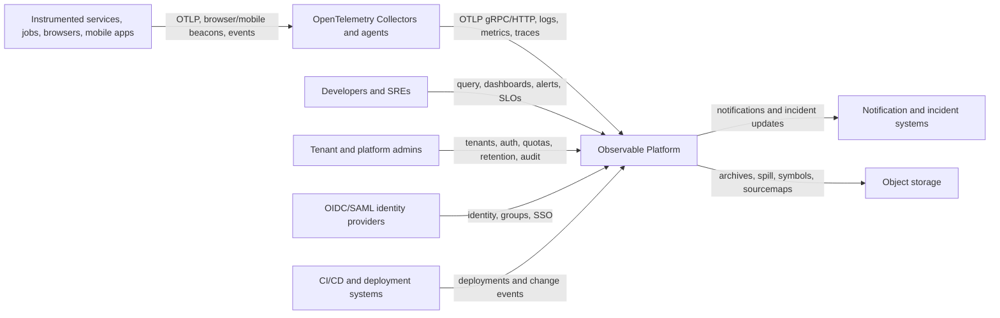
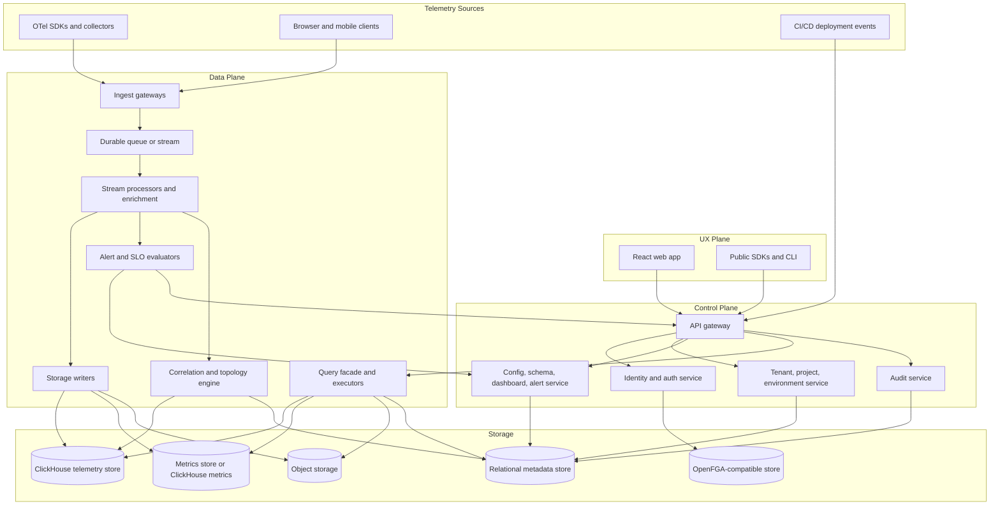

# Architecture

## 3. Reference Architecture

### 3.0 System Context

Observable is the central telemetry platform between instrumented workloads, operators, external identity providers, notification channels, and long-term storage services. OpenTelemetry remains the external telemetry contract.

**Primary actors**
- Developers and SREs explore telemetry, build dashboards, define alerts, and investigate incidents.
- Tenant admins manage users, projects, environments, API keys, quotas, retention, and audit trails.
- Platform admins operate shared infrastructure, upgrades, policy controls, and regulated deployment variants.
- Instrumented workloads emit telemetry through OTel SDKs, agents, collectors, browser beacons, mobile SDKs, and synthetic checks.

**External systems**
- Identity providers supply OIDC/SAML authentication and group claims.
- CI/CD systems publish deployment and change events.
- Notification and incident systems receive alert and incident outputs.
- Object storage holds archives, query spill, symbols, sourcemaps, profile blobs, and long-term artifacts.

### 3.1 Top-Level Domains

**Control plane**
- tenant/account management
- authn/authz
- billing/quotas
- schema/catalog
- configuration
- deployment/orchestration metadata
- alert definitions
- SLO definitions
- feature flags
- audit logs

**Data plane**
- ingest gateways
- stream processing
- enrichment
- storage writers
- query APIs
- alert evaluation
- correlation engine
- ML/anomaly jobs
- RUM edge collectors

**UX plane**
- React web app
- query workbench
- dashboards
- admin console
- setup/onboarding
- incident console

### 3.2 Container Diagram

The platform is split into control plane, data plane, and UX plane containers. The container boundaries below are deployment and ownership boundaries, not necessarily one process per box.

**Container responsibilities**
- **API gateway:** routes public APIs, enforces authentication, applies tenant context, and fronts control/data APIs.
- **Identity and auth service:** integrates OIDC/SAML, resolves principals, and delegates fine-grained checks to the OpenFGA-compatible store.
- **Tenant/project/environment service:** owns tenancy metadata, isolation mode, quota, residency, and environment configuration.
- **Config/schema/dashboard/alert service:** owns mutable product configuration and validates config-as-code inputs.
- **Audit service:** records credential, config, query, admin, and data access events.
- **Ingest gateways:** accept OTLP and edge telemetry, authenticate producers, validate payloads, apply tenant routing, and write to the durable queue.
- **Stream processors and enrichment:** normalize payloads, enrich resource metadata, apply sampling/filtering, enforce cardinality controls, and fan out to writers/evaluators.
- **Storage writers:** perform idempotent writes into telemetry stores and object storage.
- **Query facade and executors:** expose signal-specific and cross-signal query APIs, perform pushdown, and hide storage-engine differences from clients.
- **Alert and SLO evaluators:** evaluate threshold and burn-rate rules from materialized telemetry and emit notifications/incidents.
- **Correlation and topology engine:** derives service maps, RED metrics, trace-log links, deployment correlation, and topology rollups.

**Boundary rules**
- Control plane services never store high-volume telemetry.
- Data plane services must be horizontally scalable and tenant-aware.
- Storage engines are hidden behind service APIs; UI and SDK clients do not call storage engines directly.
- Every service emits health, metrics, traces, and logs.
- Tenant context is mandatory on every API, queue message, storage write, query, and audit record.

---

## 4. Core Technical Architecture

### 4.1 Ingestion

**Required interfaces**
- OTLP/gRPC
- OTLP/HTTP
- Prometheus remote_write receiver
- OpenTelemetry Collector-compatible export target
- log shipper integrations
- browser beacon intake
- mobile SDK intake
- synthetic check intake

**Ingestion pipeline stages**
1. authn/authz
2. tenant routing
3. validation
4. normalization
5. sampling/filtering
6. enrichment
7. cardinality enforcement
8. durable buffering
9. fan-out to storage/index/materialization
10. ingest acknowledgements and metrics

**Design rules**
- Stateless ingest edge.
- Durable queue before expensive transforms.
- Exactly-once is not mandatory; at-least-once + idempotent write design is acceptable.
- Backpressure must degrade gracefully:
  - drop debug logs before traces
  - reduce exemplars before metrics
  - apply tail-sampling policy changes under load

### 4.2 Processing

**Hot path** (sub-second to a few seconds)
- validation
- enrichment
- routing
- indexing
- alert materialization

**Warm path** (seconds to minutes)
- service topology
- RED/USE aggregates
- trace-derived metrics
- deployment correlation
- cardinality analysis

**Cold path** (minutes to hours)
- long-range downsampling
- anomaly models
- retention tiering
- compaction
- cost reports

### 4.3 Query

**Query language principle:** Observable does not have and will not introduce a proprietary query
DSL. SQL/DataFusion is the canonical query IR. All query surfaces — NLQ, UI filter panels, faceted
search, trace/log/metric explorers — compile to SQL. See [ADR-026](adr/ADR-026-no-proprietary-query-dsl.md).

**NLQ/MCP translation layer:** Natural language queries go through a three-stage pipeline:
`NLQ → LLM → NLQ IR → MCP Server → SQL/DataFusion`. The MCP server encodes time-series semantics
(rate, windowing, downsampling) in code and returns a typed VisualizationFrame for auto-graphing.
See [ADR-021](adr/ADR-021-nl-query-layer.md) and [spec/08 §13.1](08-ai-ml.md).

Expose separate logical APIs:
- trace query API
- metric query API
- log query API
- profile query API
- cross-signal query API
- topology API
- alert/SLO API
- configuration API

Provide a unified query facade in the UI and SDK.
