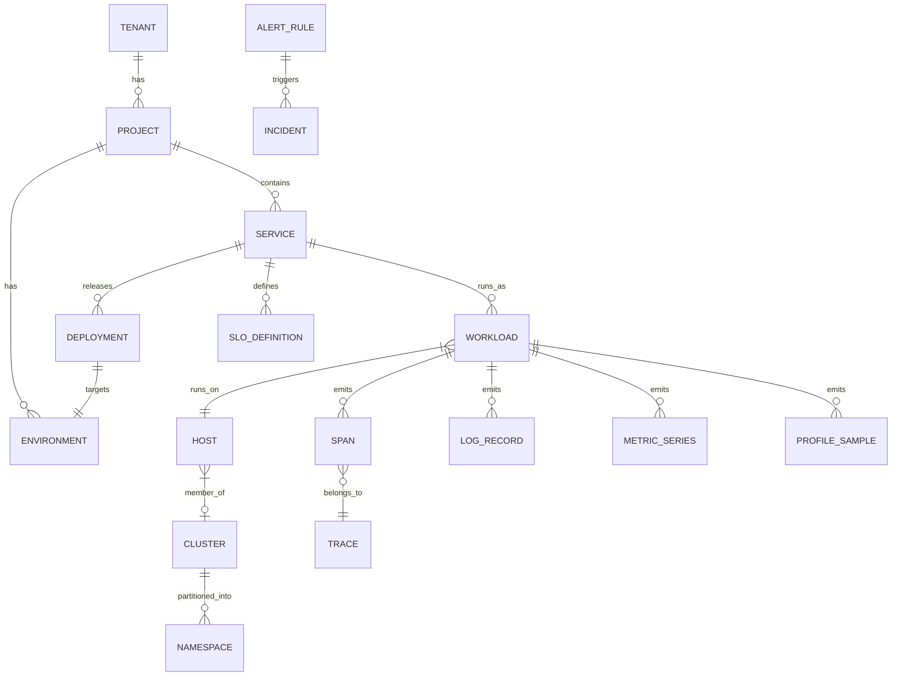

# Domain Model

This document is the authoritative domain model for the Observable platform. It defines all core entities, their relationships, telemetry schemas, cross-signal join keys, state machines, and authorization model. Other specs (query language, ADRs, storage) should reference this document rather than define their own entity schemas.

---

## 1. Entity Glossary

### Tenant
A top-level isolation boundary. All data within Observable belongs to exactly one tenant. Tenant boundaries are enforced at the storage, query, and API layers. No data crosses tenant boundaries without explicit export.

- **Cardinality:** 1 Tenant has 1..N Projects
- **OTel resource attribute:** `observable.tenant_id` (injected at ingest)

### Account
The billing entity. An account maps to one or more projects and owns the subscription, usage limits, and billing contact. In single-project setups, account and project map one-to-one.

- **Cardinality:** 1 Account has 1..N Projects
- **OTel resource attribute:** none (billing metadata, not signal metadata)

### Organization
An optional grouping layer between account and project, used in enterprise deployments to model divisions, business units, or subsidiaries. When present, an organization owns one or more projects within an account.

- **Cardinality:** 1 Account has 0..N Organizations; 1 Organization has 1..N Projects
- **OTel resource attribute:** none

### Project
A logical grouping of services and environments within a tenant. A project is the primary unit of access control and configuration. Teams typically own one or more projects.

- **Cardinality:** 1 Project has 1..N Environments, 1..N Services
- **OTel resource attribute:** `observable.project_id` (injected at ingest)

### Environment
A named deployment stage within a project (e.g. production, staging, development, canary). Environments partition signals so that metrics and traces from different stages do not mix in queries unless explicitly requested.

- **Cardinality:** belongs to 1 Project; receives 0..N Deployments; runs 0..N Workloads
- **OTel resource attribute:** `deployment.environment` (OTel semantic convention)

### Service
A named deployable unit — a microservice, monolith, function, or job. The service is the primary entity around which SLOs, alerts, and RED metrics are organized.

- **Cardinality:** 1 Service has 1..N Workloads, 1..N Deployments
- **OTel resource attributes:** `service.name`, `service.namespace`

### Workload
A runtime instance of a service — a pod, process, container, or serverless invocation. Workloads are ephemeral; they are created when a service instance starts and retired when it stops. Workload identity is derived from infrastructure metadata.

- **Cardinality:** belongs to 1 Service; runs on 1 Host; belongs to 0..1 Namespace; emits Spans, LogRecords, MetricSeries, ProfileSamples
- **OTel resource attributes:** `k8s.pod.name`, `process.pid`, `container.id`, `k8s.namespace.name`

### Deployment
A versioned release event linking a specific service version to an environment at a point in time. Deployments are used to correlate error rate changes with code changes and to annotate dashboards.

- **Cardinality:** belongs to 1 Service; targets 1 Environment
- **OTel resource attribute:** `service.version` (version carried on the release); `deployment_id` injected at ingest

### Host
A physical or virtual machine that runs one or more workloads. Host identity is used to correlate workload-level telemetry with infrastructure metrics (CPU, memory, disk, network).

- **Cardinality:** runs 0..N Workloads; member of 0..1 Cluster
- **OTel resource attributes:** `host.id`, `host.name`

### Cluster
A Kubernetes cluster or orchestration domain. Clusters group hosts and namespaces and provide a join key for infrastructure-level aggregations.

- **Cardinality:** 1 Cluster has 1..N Hosts, 1..N Namespaces
- **OTel resource attribute:** `k8s.cluster.name`

### Namespace
A Kubernetes namespace within a cluster, used to isolate workloads within a shared cluster. Namespaces map to teams or services in most deployments.

- **Cardinality:** belongs to 1 Cluster; contains 0..N Workloads
- **OTel resource attribute:** `k8s.namespace.name`

---

## 2. Core Telemetry Entity Schemas

The fields below align with OTel semantic conventions (1.x). Fields marked `resource attr` are carried in the OTel resource attributes map, not the signal body. All schemas include `tenant_id` as the mandatory first-level partition key.

### Telemetry Model Consistency Rules

- OTel remains the external ingestion contract; internal fields may be denormalized for query speed, but they must preserve the original OTel identity, resource attributes, scope attributes, signal attributes, timestamps, and flags needed to reconstruct the signal.
- Cross-signal joins must always include `tenant_id`; IDs such as `trace_id`, `span_id`, `metric_series_id`, and `log_id` are not globally meaningful across tenants.
- `trace_id` identifies a distributed trace. `span_id` identifies one span within that trace. A log may carry `trace_id` without `span_id`; in that case it joins to the trace, not to a specific span.
- Span events are part of the span payload. They are not stored as LogRecords unless an explicit transformation duplicates them into the log pipeline.
- Metrics are modeled as OTel instruments and data points, not as a single generic numeric table. The model must support gauges, sums/counters, histograms, exponential histograms, summaries, exemplars, monotonicity, and delta/cumulative temporality.

### Span

| Field | Type | Required | OTel Mapping |
|---|---|---|---|
| tenant_id | UUID | yes | resource attr: `observable.tenant_id` |
| trace_id | bytes[16] | yes | `trace_id` |
| span_id | bytes[8] | yes | `span_id` |
| parent_span_id | bytes[8] | no | `parent_span_id` |
| service_name | string | yes | resource attr: `service.name` |
| service_namespace | string | no | resource attr: `service.namespace` |
| service_version | string | no | resource attr: `service.version` |
| operation_name | string | yes | `name` |
| span_kind | enum(INTERNAL, SERVER, CLIENT, PRODUCER, CONSUMER) | yes | `kind` |
| start_time_unix_nano | uint64 | yes | `start_time_unix_nano` |
| end_time_unix_nano | uint64 | yes | `end_time_unix_nano` |
| duration_ns | uint64 | yes | derived: `end - start` |
| status_code | enum(OK, ERROR, UNSET) | yes | `status.code` |
| status_message | string | no | `status.message` |
| attributes | map[string]AnyValue | no | `attributes` |
| events | array[SpanEvent] | no | `events` |
| links | array[SpanLink] | no | `links` |
| resource_attributes | map[string]AnyValue | no | `resource.attributes` |
| deployment_id | string | no | injected at ingest |
| environment | string | no | resource attr: `deployment.environment` |
| host_id | string | no | resource attr: `host.id` |
| workload | string | no | resource attr: `k8s.pod.name` / `process.pid` |

**Retention tier default:** hot (3-14d)

---

### Trace

A Trace is a materialized rollup over its constituent Spans. It is written once (or updated incrementally) as spans arrive and provides fast trace-level queries without scanning all spans.

| Field | Type | Required | OTel Mapping |
|---|---|---|---|
| tenant_id | UUID | yes | resource attr: `observable.tenant_id` |
| trace_id | bytes[16] | yes | `trace_id` |
| root_span_id | bytes[8] | yes | derived from root span |
| root_operation_name | string | yes | `name` of root span |
| service_name | string | yes | resource attr: `service.name` of root span |
| start_time_unix_nano | uint64 | yes | min(`start_time_unix_nano`) across spans |
| end_time_unix_nano | uint64 | yes | max(`end_time_unix_nano`) across spans |
| duration_ns | uint64 | yes | `end - start` of trace |
| span_count | uint32 | yes | count of spans in trace |
| error_span_count | uint32 | yes | count of spans with `status.code = ERROR` |
| has_error | bool | yes | derived: `error_span_count > 0` |
| services | array[string] | yes | distinct service_names in trace |
| environment | string | no | resource attr: `deployment.environment` |
| deployment_id | string | no | injected at ingest |

**Retention tier default:** hot (3-14d)

---

### LogRecord

A LogRecord may be correlated to tracing context, but logs are independent signals. The canonical exact span-log join is `tenant_id + trace_id + span_id` when both trace fields are present. A log with only `trace_id` is trace-correlated and should appear in trace-level log views, but it must not be attributed to a specific span without an additional time/resource heuristic.

| Field | Type | Required | OTel Mapping |
|---|---|---|---|
| tenant_id | UUID | yes | resource attr: `observable.tenant_id` |
| log_id | UUID | yes | generated at ingest |
| timestamp_unix_nano | uint64 | yes | `timestamp_unix_nano` |
| observed_timestamp_unix_nano | uint64 | yes | `observed_timestamp_unix_nano` |
| severity_number | int32 | yes | `severity_number` (1-24, OTel spec) |
| severity_text | string | no | `severity_text` |
| body | AnyValue | yes | `body` |
| trace_id | bytes[16] | no | `trace_id` |
| span_id | bytes[8] | no | `span_id` |
| trace_flags | uint32 | no | `trace_flags` |
| attributes | map[string]AnyValue | no | `attributes` |
| resource_attributes | map[string]AnyValue | no | `resource.attributes` |
| service_name | string | yes | resource attr: `service.name` |
| environment | string | no | resource attr: `deployment.environment` |
| host_id | string | no | resource attr: `host.id` |
| fingerprint | uint64 | no | log pattern hash; injected at ingest |
| parsed_fields | map[string]string | no | extracted structured fields; injected at ingest |

**Retention tier default:** warm (up to 60d); hot for error/fatal severity

---

### MetricSeries

A MetricSeries represents one OTel metric stream: metric identity plus resource attributes, instrumentation scope, metric attributes, type, and aggregation contract. MetricPoints are associated with a series.

| Field | Type | Required | OTel Mapping |
|---|---|---|---|
| tenant_id | UUID | yes | resource attr: `observable.tenant_id` |
| metric_series_id | UUID | yes | generated at ingest from tenant, resource identity, scope, metric name, attributes, type, temporality |
| metric_name | string | yes | `name` |
| description | string | no | `description` |
| unit | string | no | `unit` |
| type | enum(gauge, sum, histogram, exponential_histogram, summary) | yes | `data` oneof type |
| is_monotonic | bool | no | `sum.is_monotonic` |
| aggregation_temporality | enum(delta, cumulative) | no | `aggregation_temporality`; required for sum, histogram, and exponential_histogram |
| attributes | map[string]string | yes | `attributes` (the label set) |
| resource_attributes | map[string]AnyValue | no | `resource.attributes` |
| scope_name | string | no | instrumentation scope `name` |
| scope_version | string | no | instrumentation scope `version` |
| schema_url | string | no | resource/scope/metric schema URL when provided |
| service_name | string | yes | resource attr: `service.name` |
| environment | string | no | resource attr: `deployment.environment` |

**Retention tier default:** hot (3-14d) → warm with rollups

---

### MetricPoint

A single data point within a MetricSeries at a specific timestamp. Exactly one value family is populated per point, according to the series `type`.

| Field | Type | Required | OTel Mapping |
|---|---|---|---|
| tenant_id | UUID | yes | partitioning key |
| metric_series_id | UUID | yes | foreign key to MetricSeries |
| metric_name | string | yes | denormalized for query performance |
| service_name | string | yes | denormalized for query performance |
| time_unix_nano | uint64 | yes | `time_unix_nano` |
| start_time_unix_nano | uint64 | no | `start_time_unix_nano`; required for delta/cumulative sums and histograms when provided by source |
| value_double | float64 | no | `as_double` (gauge/sum) |
| value_int | int64 | no | `as_int` (gauge/sum) |
| histogram_count | uint64 | no | `histogram.data_point.count` |
| histogram_sum | float64 | no | `histogram.data_point.sum` |
| histogram_bucket_counts | array[uint64] | no | `histogram.data_point.bucket_counts` |
| histogram_explicit_bounds | array[float64] | no | `histogram.data_point.explicit_bounds` |
| exp_histogram_scale | int32 | no | `exponential_histogram.data_point.scale` |
| exp_histogram_zero_count | uint64 | no | `exponential_histogram.data_point.zero_count` |
| exp_histogram_positive | ExponentialHistogramBuckets | no | `exponential_histogram.data_point.positive` |
| exp_histogram_negative | ExponentialHistogramBuckets | no | `exponential_histogram.data_point.negative` |
| summary_count | uint64 | no | `summary.data_point.count` |
| summary_sum | float64 | no | `summary.data_point.sum` |
| summary_quantile_values | array[QuantileValue] | no | `summary.data_point.quantile_values` |
| exemplars | array[Exemplar] | no | `exemplars` |
| flags | uint32 | no | `flags` |

**Retention tier default:** hot (3-14d); cold with hourly/daily rollups at warm/cold tiers

---

### Metric Type Semantics

| Metric type | Required point fields | Semantics |
|---|---|---|
| `gauge` | one of `value_double`, `value_int` | Latest sampled value. No aggregation temporality. |
| `sum` | one of `value_double`, `value_int`; `is_monotonic`; `aggregation_temporality` | Counter-like streams when monotonic, up/down sums when non-monotonic. Supports delta and cumulative sources. |
| `histogram` | `histogram_count`, optional `histogram_sum`, `histogram_bucket_counts`, `histogram_explicit_bounds`, `aggregation_temporality` | Explicit bucket distribution for latency, size, and similar measurements. |
| `exponential_histogram` | `histogram_count`, optional `histogram_sum`, `exp_histogram_scale`, positive/negative buckets, `aggregation_temporality` | Base-2 exponential bucket distribution. Preserve native representation instead of converting to explicit buckets at ingest. |
| `summary` | `summary_count`, optional `summary_sum`, `summary_quantile_values` | Imported compatibility type. Do not use summary quantiles for cross-series aggregation. |

Metric query and alert code must respect OTel temporality:
- Delta streams can be summed over query windows directly after alignment.
- Cumulative monotonic streams require reset-aware rate/increase calculations.
- Histograms and exponential histograms aggregate by bucket representation; conversion between explicit and exponential buckets is a query-layer operation, not a required ingest mutation.
- Exemplars may carry `trace_id` and `span_id`; they provide precise metric-to-trace correlation for sampled measurements.

### ProfileSample

| Field | Type | Required | OTel Mapping |
|---|---|---|---|
| tenant_id | UUID | yes | resource attr: `observable.tenant_id` |
| profile_id | UUID | yes | OTel Profiles: `profile_id` |
| service_name | string | yes | resource attr: `service.name` |
| service_version | string | no | resource attr: `service.version` |
| environment | string | no | resource attr: `deployment.environment` |
| start_time_unix_nano | uint64 | yes | `start_time_unix_nano` |
| end_time_unix_nano | uint64 | no | `end_time_unix_nano` |
| duration_ns | uint64 | yes | derived or explicit |
| sample_type | string | yes | OTel Profiles: `sample_type.type` (e.g. `cpu`, `heap`, `goroutine`) |
| sample_unit | string | yes | OTel Profiles: `sample_type.unit` (e.g. `nanoseconds`, `bytes`) |
| period | int64 | yes | OTel Profiles: `period` |
| period_type | string | yes | OTel Profiles: `period_type.type` |
| frames | array[StackFrame] | yes | OTel Profiles: `location` + `function` tables |
| attributes | map[string]AnyValue | no | `attribute_units` / `attributes` |
| host_id | string | no | resource attr: `host.id` |
| workload | string | no | resource attr: `k8s.pod.name` |

**Retention tier default:** cold (2-12 months); hot only for on-demand continuous profiling windows

---

### Event

An Event is a discrete occurrence that is not a log line — a deployment, config change, incident trigger, or manual annotation. Events are rendered as overlay markers on dashboards and timelines.

| Field | Type | Required | OTel Mapping |
|---|---|---|---|
| tenant_id | UUID | yes | `observable.tenant_id` |
| event_id | UUID | yes | generated at ingest |
| event_name | string | yes | human-readable label |
| timestamp_unix_nano | uint64 | yes | event occurrence time |
| source_type | enum(deployment, config_change, incident, manual, alert_fired, alert_resolved) | yes | Observable internal |
| payload | JSON | yes | arbitrary structured event data |
| trace_id | bytes[16] | no | optional trace context |
| span_id | bytes[8] | no | optional span context |
| service_name | string | no | associated service |
| environment | string | no | associated environment |
| deployment_id | string | no | for `source_type = deployment` |
| created_by | string | no | user or system that created the event |

**Retention tier default:** warm (up to 60d)

---

### SyntheticCheck

A SyntheticCheck is the result of one execution of a synthetic monitor — an HTTP probe, multi-step journey, or API check run from a specific region.

| Field | Type | Required | OTel Mapping |
|---|---|---|---|
| tenant_id | UUID | yes | `observable.tenant_id` |
| check_id | UUID | yes | ID of the check definition |
| check_name | string | yes | human-readable name |
| target_url | string | yes | URL or endpoint under test |
| status | enum(PASS, FAIL, TIMEOUT, ERROR) | yes | Observable internal |
| duration_ms | uint32 | yes | total check duration |
| timestamp_unix_nano | uint64 | yes | check execution time |
| region | string | yes | probe region (e.g. `us-east-1`) |
| assertions_passed | uint32 | yes | number of assertions that passed |
| assertions_failed | uint32 | yes | number of assertions that failed |
| assertion_details | array[AssertionResult] | no | per-assertion pass/fail detail |
| http_status_code | uint32 | no | HTTP response code |
| trace_id | bytes[16] | no | W3C trace context if injected into probe request |
| error_message | string | no | error detail on FAIL/TIMEOUT |
| environment | string | no | target environment label |

**Retention tier default:** warm (30-60d)

---

## 3. Cross-Signal Join Key Matrix

| From | To | Join Key | Notes |
|---|---|---|---|
| Span | LogRecord | `tenant_id` + `trace_id` + `span_id` | Exact span-log correlation when logs carry full trace context; use `tenant_id` + `trace_id` for trace-level log views when `span_id` is absent |
| Span | MetricPoint | exemplar `trace_id` + `span_id` | Precise correlation when exemplars are present; otherwise fall back to service/resource attributes plus time window |
| Span | Deployment | `service_name` + `deployment_id` | `deployment_id` injected at ingest from active deployment registry |
| Span | Event | `trace_id` (optional) | Events may not carry trace context; fall back to `service_name` + time proximity |
| Span | Trace | `tenant_id` + `trace_id` | 1:N; every span belongs to exactly one trace within a tenant |
| LogRecord | Host | `host.id` (resource attr) | Extracted from `resource_attributes`; requires OTel resource enrichment |
| LogRecord | Span | `tenant_id` + `trace_id` + `span_id` | Bidirectional exact join; span must be in retention window |
| Workload | Host | `host_id` | Scheduling metadata; populated by infra agent or k8s metadata enrichment |
| Workload | Span | `service_name` + workload identifiers | Via resource attributes (`k8s.pod.name`, `process.pid`) |
| Workload | MetricSeries | `service_name` + `k8s.pod.name` | For per-instance RED metric breakdown |
| Service | Deployment | `service_name` | Latest deployment per environment; join on `service_name` + `environment` |
| Service | SLODefinition | `service_name` | SLO is defined at service level |
| MetricSeries | Service | `service_name` (label) | For RED metrics derivation (rate, errors, duration) |
| MetricPoint | Span | exemplar `trace_id` + `span_id` | High-value exemplars carry trace context for precise trace-metric correlation |
| ProfileSample | Service | `service_name` | For profiling explorer and flame graph aggregation |
| ProfileSample | Span | `trace_id` (optional) | Continuous profiling correlation; requires trace context propagation |
| SyntheticCheck | Span | `trace_id` | Only when probe injects W3C trace context into outbound request |
| Event | Deployment | `deployment_id` | For `source_type = deployment` events |

---

## 4. Entity Relationship Diagram



---

## 5. SLO, Alert, and Incident Entities

### Deployment

A Deployment entity is the authoritative record of a versioned release event. It is the join key for deployment correlation across all signal types.

| Field | Type | Required | Notes |
|---|---|---|---|
| deployment_id | UUID | yes | generated at ingest or via CI/CD API |
| tenant_id | UUID | yes | |
| project_id | UUID | yes | |
| service_name | string | yes | must match a known Service entity |
| environment | string | yes | target environment |
| service_version | string | yes | version string from `service.version` resource attribute |
| deployed_by | string | no | user or system identity that triggered the deployment |
| commit_sha | string | no | VCS commit identifier |
| started_at | timestamp | yes | deployment initiation time |
| finished_at | timestamp | no | deployment completion time; null if in-progress |
| status | enum(in_progress, success, failed, rolled_back) | yes | |
| rollback_of | UUID | no | `deployment_id` of the deployment this reverts |
| metadata | JSON | no | arbitrary structured deployment metadata from CI/CD payload |

### AlertRule

An AlertRule defines the conditions under which a notification is sent or an incident is triggered. Alert rules are evaluated continuously by the alert evaluator against materialised telemetry.

| Field | Type | Required | Notes |
|---|---|---|---|
| rule_id | UUID | yes | |
| tenant_id | UUID | yes | |
| project_id | UUID | yes | |
| service_name | string | no | if absent, rule applies across all services in the project |
| environment | string | no | if absent, rule applies across all environments |
| name | string | yes | human-readable rule name |
| alert_type | enum(threshold, anomaly, change_detection, deadman, composite, topology_impact, slo_burn_rate, deployment_regression) | yes | |
| severity | enum(critical, warning, info) | yes | |
| condition | string | yes | query expression or burn-rate spec defining the firing condition |
| for_duration | duration | no | minimum time the condition must be met before firing (avoids flapping) |
| labels | map[string]string | no | routing and grouping labels attached to fired alerts |
| annotations | map[string]string | no | human-readable context: summary, description, runbook URL |
| notification_channels | array[string] | no | channel IDs to notify on state change |
| auto_trigger_incident | bool | yes | if true, an Incident is created when the rule enters Active state |
| auto_trigger_delay | duration | no | grace period after alert fires before auto-creating an Incident; default 0 |
| created_by | string | yes | user or system that created the rule |
| created_at | timestamp | yes | |
| updated_at | timestamp | yes | |

### Incident

An Incident is a structured event representing a service disruption. Incidents are created automatically from AlertRule firings (when `auto_trigger_incident = true`) or manually by operators.

| Field | Type | Required | Notes |
|---|---|---|---|
| incident_id | UUID | yes | |
| tenant_id | UUID | yes | |
| project_id | UUID | yes | |
| service_name | string | yes | primary service affected |
| environment | string | yes | |
| title | string | yes | human-readable summary |
| severity | enum(critical, warning, info) | yes | inherited from triggering AlertRule or set manually |
| status | enum(triggered, acknowledged, investigating, resolved, post_mortem) | yes | see state machine below |
| dedup_key | string | yes | used to prevent duplicate incidents; derived from rule_id + service_name + environment |
| triggered_by_rule_id | UUID | no | `rule_id` of the AlertRule that triggered this incident |
| triggered_at | timestamp | yes | |
| acknowledged_at | timestamp | no | |
| acknowledged_by | string | no | |
| resolved_at | timestamp | no | |
| resolved_by | string | no | |
| runbook_url | string | no | |
| timeline | array[IncidentEvent] | no | ordered list of responder actions and system events |
| related_deployment_id | UUID | no | deployment correlated with the incident |
| slo_impact | JSON | no | calculated error budget burn during the incident window |
| postmortem_url | string | no | link to post-mortem document |
| created_at | timestamp | yes | |
| updated_at | timestamp | yes | |

**IncidentEvent** (embedded in `timeline`):

| Field | Type | Notes |
|---|---|---|
| event_time | timestamp | |
| event_type | enum(triggered, acknowledged, comment, status_change, deployment_linked, alert_fired, alert_resolved) | |
| actor | string | user or system |
| message | string | |

### SLODefinition

An SLO is a target for service reliability expressed as a ratio over a rolling time window. SLOs are evaluated continuously using burn rate calculations over MetricSeries and Span data.

| Field | Type | Notes |
|---|---|---|
| slo_id | UUID | |
| tenant_id | UUID | |
| project_id | UUID | |
| service_name | string | must match a known Service entity |
| environment | string | SLO is environment-scoped |
| sli_type | enum(availability, latency, error_rate, throughput) | determines how the SLI is computed |
| target | float64 | 0-1, e.g. `0.999` for 99.9% |
| window_days | int | rolling window length, e.g. `30` |
| latency_threshold_ms | uint32 | for `sli_type = latency`; good request threshold |
| burn_rate_fast_threshold | float64 | fast-burn alert multiplier (e.g. `14.4` = consume 2% budget in 1h) |
| burn_rate_slow_threshold | float64 | slow-burn alert multiplier (e.g. `1.0` = trending to miss) |
| description | string | human-readable SLO description |
| created_at | timestamp | |
| updated_at | timestamp | |

### SLOBudget (derived, not stored as primary record)

Error budget is derived continuously:
- `error_budget_total = (1 - target) * window_events`
- `error_budget_remaining = error_budget_total - bad_events`
- `burn_rate = bad_events_last_Nh / (error_budget_total * (N / window_hours))`

**SLI type definitions — what counts as a good vs. bad event:**

| `sli_type` | Good event | Bad event | Primary data source |
|---|---|---|---|
| `availability` | Span with `status_code = OK` or `UNSET` | Span with `status_code = ERROR` | Span table; filter by `service_name` + `environment` |
| `latency` | Span where `duration_ns <= latency_threshold_ms * 1_000_000` | Span where `duration_ns > latency_threshold_ms * 1_000_000` | Span table; requires `latency_threshold_ms` to be set on the SLODefinition |
| `error_rate` | Request where no error attribute is set | Request where `span.attributes["error"] = true` or `status_code = ERROR` | Span table; equivalent to `availability` but expressed as a rate rather than ratio |
| `throughput` | Any ingested request event above the defined minimum rate | Any measurement window where observed request rate < configured minimum RPS threshold | Derived from `MetricSeries` (request count sum) or Span count per window |

For `availability` and `latency`, `window_events` = total spans matching `service_name + environment` within the rolling `window_days` window. For `throughput`, `window_events` = count of measurement windows within the rolling window where throughput was above threshold.

### AlertRule States

```
Pending → Active → Resolved → Silenced
Pending → Suppressed  (inhibition rule match)
Active  → Suppressed  (inhibition rule match)
```

- **Pending:** Condition has been met but the `for` duration has not elapsed (avoids flapping on transient spikes)
- **Active:** Condition has been met for the full `for` duration; notifications are firing
- **Resolved:** Condition is no longer met; resolution notification sent
- **Silenced:** Alert is firing but suppressed by an active silence rule; no notifications sent
- **Suppressed:** Alert is suppressed by an inhibition rule (a higher-severity alert is active for the same service)

### Incident States

```
Triggered → Acknowledged → Investigating → Resolved → Post-mortem
```

- **Triggered:** Alert fired and no acknowledgement within `auto_trigger_delay`; incident record created
- **Acknowledged:** On-call responder has accepted the incident
- **Investigating:** Responder is actively working the incident; timeline is being recorded
- **Resolved:** Service has recovered; resolution time recorded; SLO impact calculated
- **Post-mortem:** Incident closed; post-mortem document linked (optional, may be skipped for low-severity)

---

## 6. Authorization Entities

Observable uses a hybrid RBAC + ReBAC authorization model. Coarse-grained access is controlled by RBAC roles scoped to tenant and project. Fine-grained resource access (dashboards, incidents, data scopes) is controlled by relationship tuples in an OpenFGA-compatible store.

### Coarse RBAC Roles

| Role | Scope | Permissions |
|---|---|---|
| TenantAdmin | Tenant | All operations within tenant; manage projects, billing contacts, SSO, API keys |
| ProjectAdmin | Project | All operations within project; manage members, environments, integrations |
| Member | Project | Read + write dashboards, alerts, SLO definitions; acknowledge incidents |
| Viewer | Project | Read only; cannot write dashboards or alerts; cannot acknowledge incidents |

Role assignment is stored as `(user_id, role, scope_type, scope_id)` tuples.

### ReBAC (OpenFGA-style) Tuple Format

Fine-grained resource access uses relationship tuples:

```
(subject: user:<id>, relation: <relation>, object: <type>:<id>)
```

Examples:
- `(subject: user:alice, relation: viewer, object: dashboard:xyz)`
- `(subject: user:bob, relation: editor, object: project:prod)`
- `(subject: team:sre, relation: responder, object: incident:INC-001)`
- `(subject: user:carol, relation: owner, object: alert_rule:high-latency-checkout)`
- `(subject: team:platform, relation: admin, object: environment:production)`

### Resource Types Requiring ReBAC

| Resource Type | Relations | Notes |
|---|---|---|
| Dashboard | owner, editor, viewer | default viewer = project members |
| Project | admin, editor, viewer | parent of most other resources |
| Environment | admin, viewer | production env may restrict write access |
| Incident | responder, viewer | responder can acknowledge and resolve |
| DataScope | owner, user | defines what data a user or team can query; used for data-level access control |
| AlertRule | owner, editor, viewer | ownership for silence/modify permissions |
| SLODefinition | owner, editor, viewer | |

### DataScope Entity

A DataScope constrains what signals a subject can read, independent of project membership. Used for contractor access, compliance isolation, or per-team data partitioning.

| Field | Type | Notes |
|---|---|---|
| scope_id | UUID | |
| tenant_id | UUID | |
| allowed_services | array[string] | empty = all services |
| allowed_environments | array[string] | empty = all environments |
| allowed_signal_types | array[enum] | spans, logs, metrics, profiles |
| max_lookback_days | int | caps how far back queries can reach |
| description | string | |

---

## 7. Common Dimensions Reference

The following fields appear across all signal types and align with the common dimensions defined in `spec/03-storage.md`. They are injected or enriched at ingest time from OTel resource attributes.

| Field | OTel Resource Attribute | Description |
|---|---|---|
| `tenant_id` | `observable.tenant_id` | Top-level isolation key |
| `account_id` | `observable.account_id` | Billing entity |
| `org_id` | `observable.org_id` (injected at ingest) | Organization grouping layer; only populated for tenants that have Organizations configured. Injected by the control plane at ingest from the project-to-organization mapping. Not emitted by OTel SDKs. |
| `project_id` | `observable.project_id` | Project scope |
| `environment` | `deployment.environment` | Named deployment stage |
| `service_name` | `service.name` | Service identifier |
| `service_namespace` | `service.namespace` | Optional service grouping |
| `service_version` | `service.version` | Deployed version |
| `deployment_id` | injected at ingest | Active deployment at time of signal |
| `region` | `cloud.region` | Cloud or datacenter region |
| `cloud_provider` | `cloud.provider` | e.g. `aws`, `gcp`, `azure` |
| `cluster` | `k8s.cluster.name` | Kubernetes cluster |
| `namespace` | `k8s.namespace.name` | Kubernetes namespace; also present in Workload schema denormalized from this dimension |
| `workload` | `k8s.pod.name` / `process.pid` | Runtime instance identifier |
| `host_id` | `host.id` | Physical/virtual machine ID |
| `container_id` | `container.id` | Container instance ID |
| `trace_id` | `trace_id` | Distributed trace identifier |
| `span_id` | `span_id` | Span within trace |
| `session_id` | `observable.session_id` (injected by browser/mobile SDK) | RUM session identifier. Present on signals emitted from browser or mobile SDK instrumentation. Absent on server-side signals unless explicitly propagated via W3C baggage. Used for "user session ↔ backend trace" correlation. |
| `user_hash` | `observable.user_hash` (injected by browser/mobile SDK) | One-way hash of the end-user identity for session attribution. Never stores raw PII. Absent on server-side signals unless explicitly propagated. |
| `tags` | n/a (platform-level annotation) | Operator-defined key-value labels attached to a project, environment, or service in the control plane. Injected at ingest alongside resource attributes. Distinct from signal-level `attributes` (which come from instrumentation). Used for cost allocation, team ownership, and cross-cutting filters that are not part of the OTel semantic model. |
